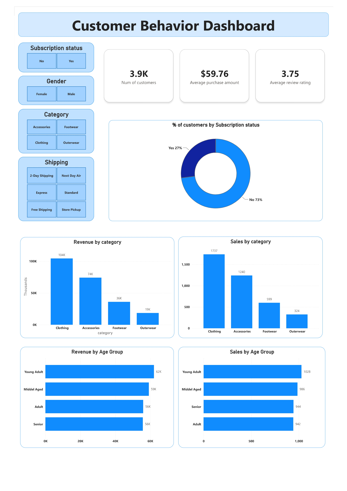

# 🛍️ Customer Shopping Behavior Analysis

A complete end-to-end data analytics project analyzing shopping patterns, customer segments, and revenue trends across 3,900 transactions — using Python, MySQL, Power BI, and AI-assisted reporting.

---

## 📌 Overview

This project explores customer shopping behavior to uncover actionable business insights. The analysis covers demographic revenue splits, subscription value, discount reliance, product ratings, and customer segmentation — walking through every stage of a real-world analytics workflow from raw data to executive presentation.

---

## 📂 Dataset

| Property | Details |
|---|---|
| Rows | 3,900 |
| Columns | 18 |
| Source | Customer transaction records |
| Missing Data | 37 null values in `Review Rating` (imputed) |

**Key columns:** `Customer ID`, `Age`, `Gender`, `Location`, `Item Purchased`, `Category`, `Purchase Amount (USD)`, `Season`, `Shipping Type`, `Discount Applied`, `Subscription Status`, `Review Rating`, `Previous Purchases`, `Frequency of Purchases`

---

## 🛠️ Tools & Technologies

| Tool | Purpose |
|---|---|
| **Python** (Pandas, Matplotlib, Seaborn) | Data loading, EDA, cleaning, feature engineering |
| **MySQL** | Business query analysis |
| **Power BI** | Interactive dashboard |
| **Gamma AI** | Auto-generated presentation |
| **Jupyter Notebook** | Development environment |

---

## 🔄 Project Workflow

### 1 — Data Loading & Exploration (Python)
- Loaded dataset using `pandas`
- Inspected structure with `df.info()` and `df.describe()`
- Identified 37 missing values in the `Review Rating` column

### 2 — Data Cleaning & Feature Engineering
- Imputed missing `Review Rating` values using the **median per product category**
- Renamed all columns to **snake_case** for consistency
- Engineered new columns:
  - `age_group` — binned from raw age values
  - `purchase_frequency_days` — derived from purchase frequency field
- Dropped `promo_code_used` (confirmed redundant with `discount_applied`)

### 3 — SQL Analysis (MySQL)
Connected the cleaned DataFrame to a MySQL server and ran 10 business queries:

| # | Question |
|---|---|
| Q1 | Revenue by gender |
| Q2 | Discount users who spent above average |
| Q3 | Top 5 products by average review rating |
| Q4 | Average spend: Standard vs. Express shipping |
| Q5 | Subscriber vs. non-subscriber spending |
| Q6 | Top 5 products by discount dependency |
| Q7 | Customer segmentation (New / Returning / Loyal) |
| Q8 | Top 3 products per category |
| Q9 | Repeat buyers (>5 purchases) and subscription likelihood |
| Q10 | Total revenue by age group |

### 4 — Power BI Dashboard
Built an interactive dashboard with slicers for Subscription Status, Gender, Category, and Shipping Type.

### 5 — Report & Presentation
- Written analysis report documenting all findings and recommendations
- Executive presentation built using **Gamma AI**

---

## 📊 Dashboard Preview



> Filters: Subscription Status · Gender · Category · Shipping Type

---

## 📈 Key Results

| Insight | Finding |
|---|---|
| **Gender Revenue** | Male customers generated ~2× more revenue than female ($157,890 vs $75,191) |
| **Subscription Rate** | Only 27% of customers are subscribed |
| **Top-Rated Products** | Gloves (3.86), Sandals (3.84), Boots (3.82) |
| **Shipping vs. Spend** | Express ($60.48 avg) slightly outperforms Standard ($58.46 avg) |
| **Customer Segments** | Loyal: 3,116 · Returning: 701 · New: 83 |
| **Discount-Heavy Products** | Hat (50%), Sneakers (49.66%), Coat (49.07%) |
| **Top Revenue Category** | Clothing ($104K), followed by Accessories ($74K) |
| **Highest Revenue Age Group** | Young Adults ($62K), closely followed by Middle-aged ($59K) |

---

## 💡 Business Recommendations

- **Boost Subscriptions** — Only 27% of customers subscribe; promote exclusive perks to grow this segment
- **Loyalty Programs** — Reward returning buyers to move them into the Loyal tier
- **Review Discount Policy** — Half of Hat and Sneaker purchases use discounts; review margin impact
- **Product Spotlighting** — Feature top-rated products (Gloves, Sandals, Boots) in marketing campaigns
- **Targeted Marketing** — Prioritize Young Adults and Express-shipping users as high-value segments

---

## 🚀 How to Run

**Prerequisites**
```
Python 3.8+
MySQL Server
Power BI Desktop
Required libraries: pandas, matplotlib, seaborn, sqlalchemy, mysql-connector-python
```

**Steps**

```bash
# 1. Clone the repository
git clone https://github.com/your-username/customer-shopping-behavior.git
cd customer-shopping-behavior

# 2. Install dependencies
pip install pandas matplotlib seaborn sqlalchemy mysql-connector-python jupyter

# 3. Open the notebook
jupyter notebook Customer_shopping_behaviour.ipynb

# 4. Set up MySQL
#    Create a database named customer_behavior
#    Update connection credentials in the notebook

# 5. Run SQL queries
#    Execute Customers_Behavior_Data_-_Collect_Insights.sql in MySQL Workbench

# 6. Open the dashboard
#    Launch Customer_Behavior_Dashboard.pbix in Power BI Desktop
```

---

## 📁 Repository Structure

```
📦 customer-shopping-behavior
 ┣ 📓 Customer_shopping_behaviour.ipynb     # Python EDA & cleaning
 ┣ 📄 customer_shopping_behavior.csv        # Raw dataset
 ┣ 🗃️  Customers_Behavior_Data_Insights.sql # SQL business queries
 ┣ 📊 Customer_Behavior_Dashboard.pbix      # Power BI dashboard
 ┣ 📝 Customer_Shopping_Behavior_Analysis.pdf # Full report
 ┣ 🖼️  dashboardjpg              # Dashboard screenshot
 ┗ 📖 README.md
```

---

## 👤 Author

**Rutvik Kihla**
[LinkedIn](https://linkedin.com/in/Rutvikkihla) · [GitHub](https://github.com/Rutvikkihla)

---

*Feel free to fork this project, raise issues, or reach out for collaboration!*
